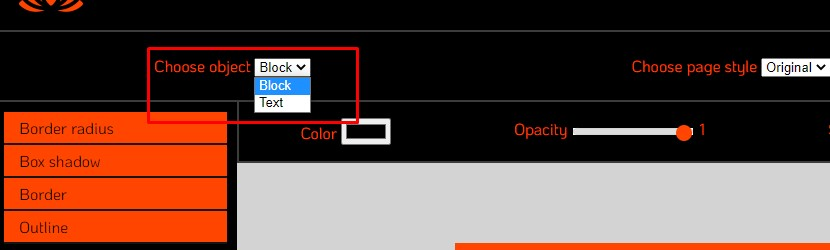
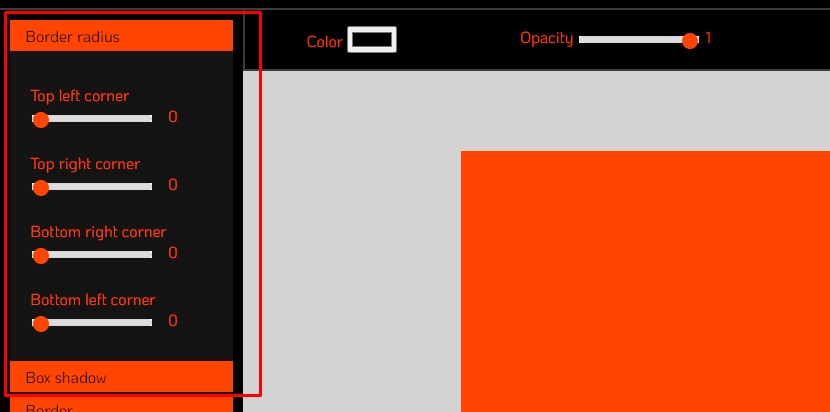
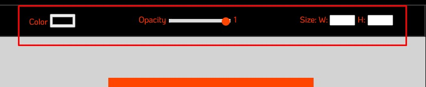
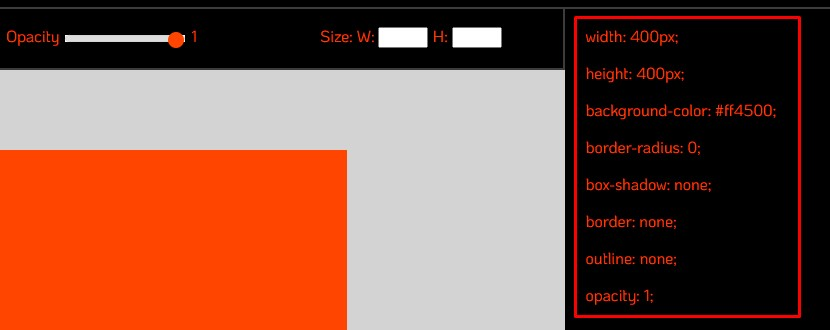

<h1 align="center">Генератор CSS стилей</h1>

<h2 align="center">Описание</h2>

Генератор CSS стилей позволяет применить некоторые css-свойства на текст или блок и сразу увидеть результат.

<h2 align="center">Как использовать</h2>

Сначала необходимо выбрать выпадающем списке к чему вы будете применять стили: к блоку или тексту.

Далее выбирайте и применяйте свойства из бокового меню

или из верхнего меню.

Просто тяните "ползунки" и сразу будет виден результат.
После того, как вы примените все нужные стили, вы можете их скопировать к себе в код.

<h2 align="center">Технологии</h2>

В этом проекте использовались: 
* HTML
* CSS
* JavaScript

<h2 align="center">Дополнительно</h2>

Этот проект создавался в качестве практики применения css-стилей посредством JavaScript. Некоторые функции,
такие как выбор стиля страницы или выбор шрифта для текста, пока что недоступны, но я планирую добавить их
в будущем. Также планируетя полный рефакторинг кода и, возможо, перенос проекта с JS на React.

***

посмотреть и попробовать можно [тут](https://natalielinen.github.io/css-styles-generator/)
